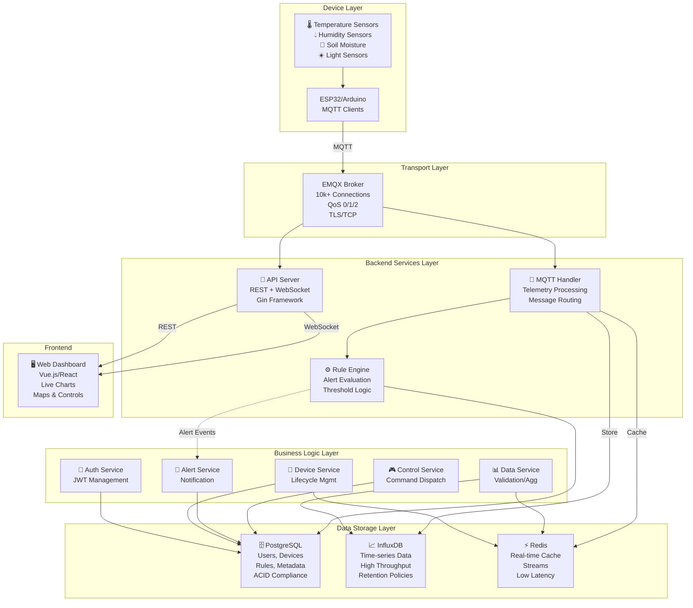
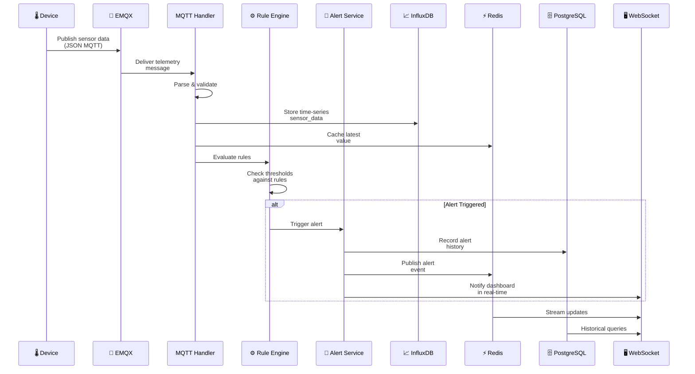
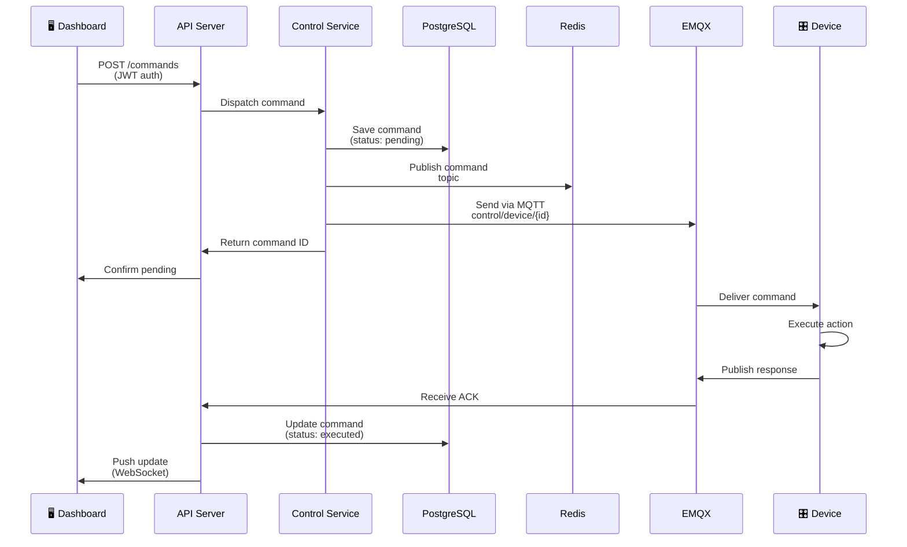

AgriSenseIoT System Architecture Overview
1. High-Level Architecture Layers

```mermaid
graph TB
    subgraph "Device Layer"
        D1["🌡️ Temperature Sensors<br/>💧 Humidity Sensors<br/>🌱 Soil Moisture<br/>☀️ Light Sensors"]
        D2["ESP32/Arduino<br/>MQTT Clients"]
    end
    
    subgraph "Transport Layer"
        EMQX["EMQX Broker<br/>10k+ Connections<br/>QoS 0/1/2<br/>TLS/TCP"]
    end
    
    subgraph "Backend Services Layer"
        API["🔧 API Server<br/>REST + WebSocket<br/>Gin Framework"]
        MQTT["📡 MQTT Handler<br/>Telemetry Processing<br/>Message Routing"]
        RULE["⚙️ Rule Engine<br/>Alert Evaluation<br/>Threshold Logic"]
    end
    
    subgraph "Business Logic Layer"
        AUTH["🔐 Auth Service<br/>JWT Management"]
        DEVICE["📱 Device Service<br/>Lifecycle Mgmt"]
        DATA["📊 Data Service<br/>Validation/Agg"]
        ALERT["🚨 Alert Service<br/>Notification"]
        CONTROL["🎮 Control Service<br/>Command Dispatch"]
    end
    
    subgraph "Data Storage Layer"
        PG["🗄️ PostgreSQL<br/>Users, Devices<br/>Rules, Metadata<br/>ACID Compliance"]
        IDB["📈 InfluxDB<br/>Time-series Data<br/>High Throughput<br/>Retention Policies"]
        REDIS["⚡ Redis<br/>Real-time Cache<br/>Streams<br/>Low Latency"]
    end
    
    subgraph "Frontend"
        WEB["🖥️ Web Dashboard<br/>Vue.js/React<br/>Live Charts<br/>Maps & Controls"]
    end
    
    D1 --> D2
    D2 -->|MQTT| EMQX
    EMQX --> MQTT
    EMQX --> API
    MQTT --> RULE
    RULE -.->|Alert Events| ALERT
    API -->|REST| WEB
    API -->|WebSocket| WEB
    AUTH --> PG
    DEVICE --> PG
    DEVICE --> REDIS
    DATA --> IDB
    DATA --> REDIS
    ALERT --> PG
    CONTROL --> PG
    MQTT -->|Store| IDB
    MQTT -->|Cache| REDIS
    RULE --> PG
```

2. Data Flow Architecture

```mermaid
sequenceDiagram
    participant Device as 🌡️ Device
    participant EMQX as 📡 EMQX
    participant Handler as MQTT Handler
    participant RuleEngine as ⚙️ Rule Engine
    participant AlertSvc as 🚨 Alert Service
    participant InfluxDB as 📈 InfluxDB
    participant Redis as ⚡ Redis
    participant PG as 🗄️ PostgreSQL
    participant WebSocket as 🖥️ WebSocket

    Device->>EMQX: Publish sensor data<br/>(JSON MQTT)
    EMQX->>Handler: Deliver telemetry<br/>message
    Handler->>Handler: Parse & validate
    Handler->>InfluxDB: Store time-series<br/>sensor_data
    Handler->>Redis: Cache latest<br/>value
    Handler->>RuleEngine: Evaluate rules
    
    RuleEngine->>RuleEngine: Check thresholds<br/>against rules
    
    alt Alert Triggered
        RuleEngine->>AlertSvc: Trigger alert
        AlertSvc->>PG: Record alert<br/>history
        AlertSvc->>Redis: Publish alert<br/>event
        AlertSvc->>WebSocket: Notify dashboard<br/>in real-time
    end
    
    Redis->>WebSocket: Stream updates
    PG->>WebSocket: Historical queries
```

3. Control Command Flow

```mermaid
sequenceDiagram
    participant Dashboard as 🖥️ Dashboard
    participant API as API Server
    participant CtrlSvc as Control Service
    participant PG as PostgreSQL
    participant Redis as Redis
    participant EMQX as EMQX
    participant Device as 🎛️ Device
    
    Dashboard->>API: POST /commands<br/>(JWT auth)
    API->>CtrlSvc: Dispatch command
    CtrlSvc->>PG: Save command<br/>(status: pending)
    CtrlSvc->>Redis: Publish command<br/>topic
    CtrlSvc->>EMQX: Send via MQTT<br/>control/device/{id}
    CtrlSvc->>API: Return command ID
    API->>Dashboard: Confirm pending
    
    EMQX->>Device: Deliver command
    Device->>Device: Execute action
    Device->>EMQX: Publish response
    
    EMQX->>API: Receive ACK
    API->>PG: Update command<br/>(status: executed)
    API->>Dashboard: Push update<br/>(WebSocket)
```