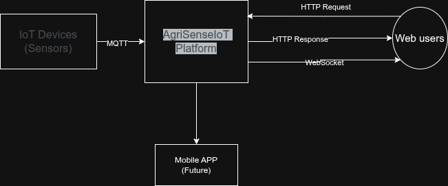
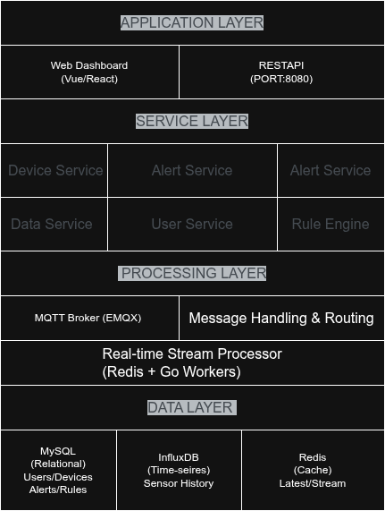
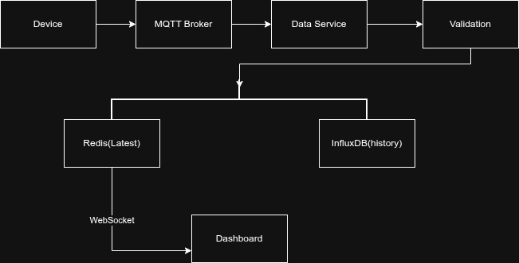
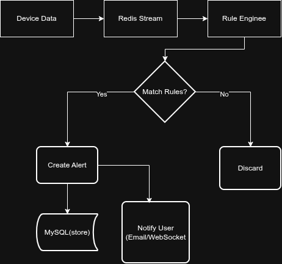
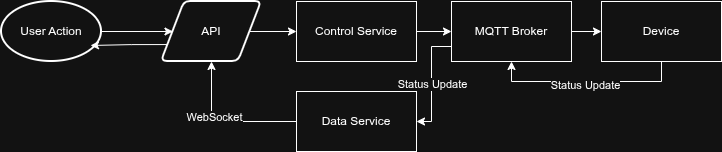
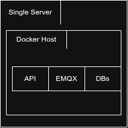

# High-Level Architecture

## System Context Diagram

## Layered Architecture

## Component Details

### 1. Device Layer
- **Physical sensors**: Temperature, humidity, soil moisture, light
- **Microcontrollers**: ESP32/Arduino with MQTT support
- **Communication**: MQTT over TCP/TLS
- **Data format**: JSON payloads

### 2. Transport Layer
- **MQTT Broker**: EMQX
  - Handles 10k+ concurrent connections
  - Manages device authentication
  - Routes messages to appropriate topics
  - QoS levels 0,1,2 support

### 3. Backend Services (Go)
| Service | Responsibility | Key Features |
|---------|----------------|--------------|
| Device Service | Device lifecycle | Registration, status, heartbeats |
| Data Service | Data processing | Validation, storage, aggregation |
| Alert Service | Alert generation | Rule evaluation, notifications |
| Control Service | Command dispatch | Manual/auto control, ACK tracking |
| User Service | User management | Auth, roles, preferences |
| Rule Engine | Business logic | Rule evaluation engine |

### 4. Data Storage Strategy

| Database | Purpose | Why |
|----------|---------|-----|
| MySQL | Relational data | ACID compliance for users/devices/rules |
| InfluxDB | Time-series data | Optimized for sensor data, high write throughput |
| Redis | Real-time data | Low latency, sliding windows for alerts |

### 5. Frontend
- **Framework**: Vue.js or React
- **Real-time updates**: WebSocket for live data
- **Charts**: Chart.js or D3.js
- **Maps**: Leaflet or Mapbox

## Data Flow

### 1. Device Data Ingestion Flow

### 2. Alert Processing Flow

### 3. Control Flow

## Technology Stack Summary

| Layer | Technology | Justification |
|-------|------------|---------------|
| Backend | Go (Gin) | High concurrency, fast performance |
| MQTT Broker | EMQX | Production-ready, scalable |
| Relational DB | MySQL | Reliable, well-known |
| Time-series DB | InfluxDB | Optimized for sensor data |
| Cache | Redis | In-memory speed for real-time |
| Frontend | Vue/React | Modern, component-based |
| Container | Docker | Consistent deployment |
| API | REST + WebSocket | Real-time updates |

## Deployment Architecture (Initial)

## Future Scalability
- Split services into separate containers
- Add load balancer for API
- Cluster EMQX for more connections
- Read replicas for MySQL
- InfluxDB enterprise for clustering

## Technology Decision Records

### Why Go?
- Excellent concurrency model for IoT
- Fast compilation and execution
- Great standard library
- Simple deployment (single binary)

### Why EMQX over Mosquitto?
- Built for clustering
- Better management UI
- More enterprise features
- Still open-source

### Why InfluxDB over Prometheus?
- Native support for string tags
- Better for IoT sensor data
- SQL-like query language
- Retention policies built-in
